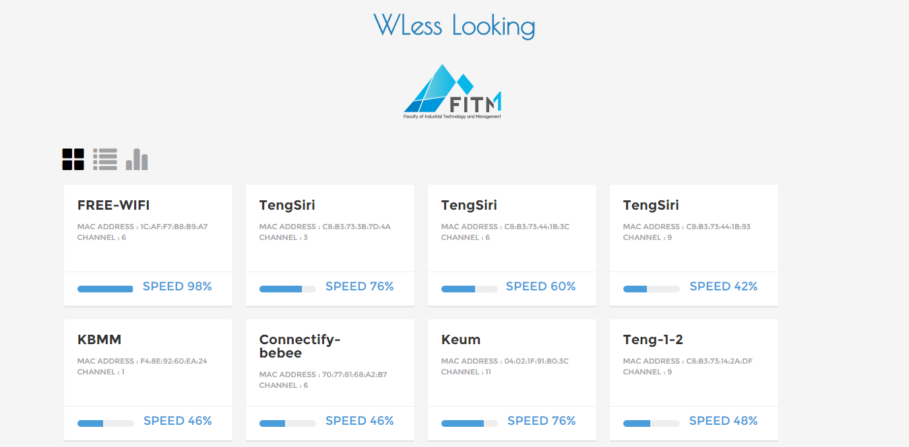
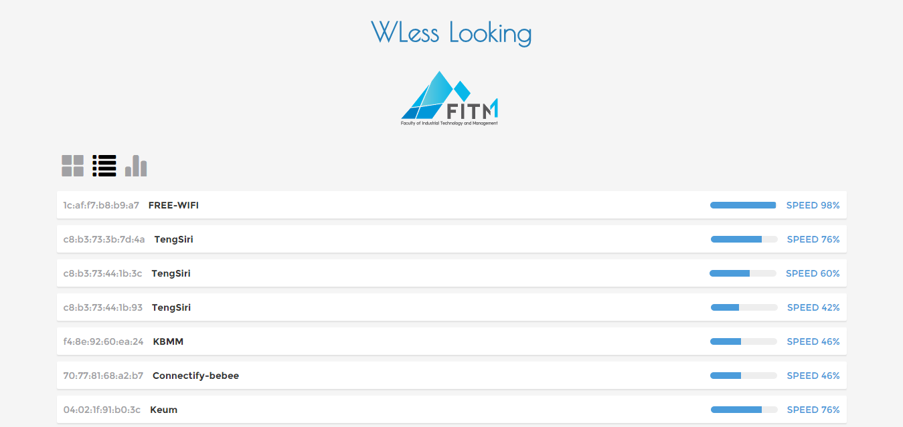
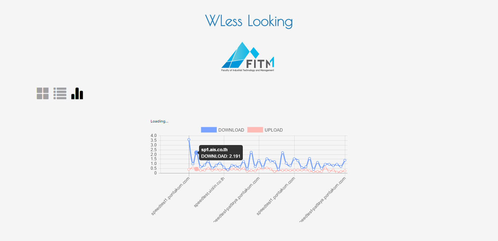

## Step use wifi-scanner
## WLess Looking



### 1. Clone
######ทำการ clone folder ลงบนเครื่องเรา
```
$ git clone https://github.com/mintkhwan/WLess_Looking.git
```
### 2. Install
######ทำการ การติดตั้ง packages ทั้งหมดที่ต้องใช้ ลงบนเครื่อง
```
$ npm install
```
### 3. Run
######ทำการ run file node เพื่อเปิดการทำงาน scan wifi
```
$ node index.js
```
